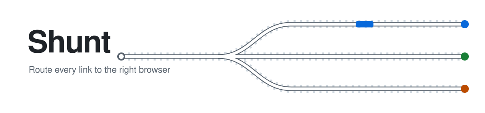
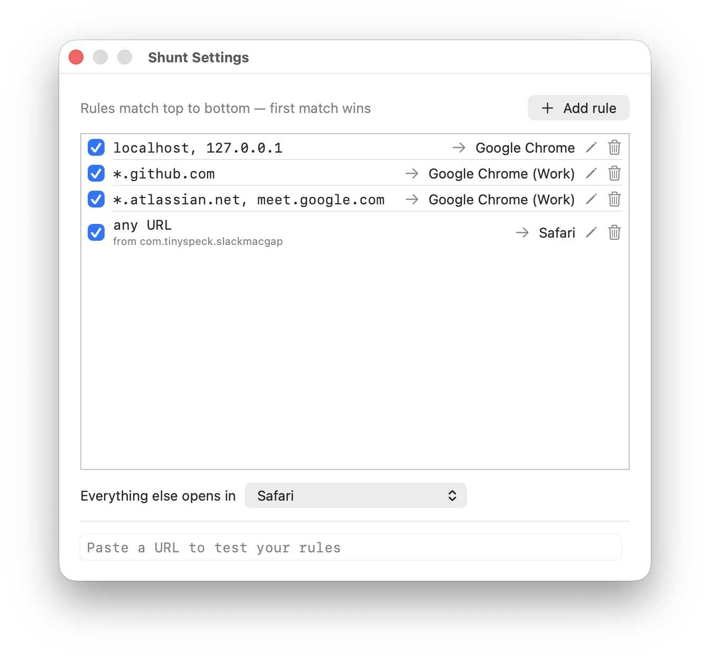

<picture>
  <source media="(prefers-color-scheme: dark)" srcset="docs/banner-dark.svg">
  
</picture>

A macOS menu bar app that acts as your default browser and routes each link to a *real* browser based on rules.



## How it works

Shunt registers as a handler for `http`/`https` URLs. When you set it as your default browser, every link you click outside a browser is sent to Shunt, which matches it against an ordered list of rules (first match wins) and forwards it to the chosen browser. Rules can match on host patterns (`*.atlassian.net`) and/or the app the link was clicked in. Anything unmatched goes to a fallback browser.

Config is stored as JSON in `~/Library/Application Support/Shunt/config.json`.

## Building

Requires macOS 14+ and the Xcode Command Line Tools (full Xcode not needed).

```bash
bin/build     # builds build/Shunt.app
bin/run       # builds and launches it
bin/install   # builds and installs to /Applications
bin/dmg       # builds and packages build/Shunt.dmg
swift test    # runs the tests
```

## License

GPL-3.0 — see [LICENSE](LICENSE).
